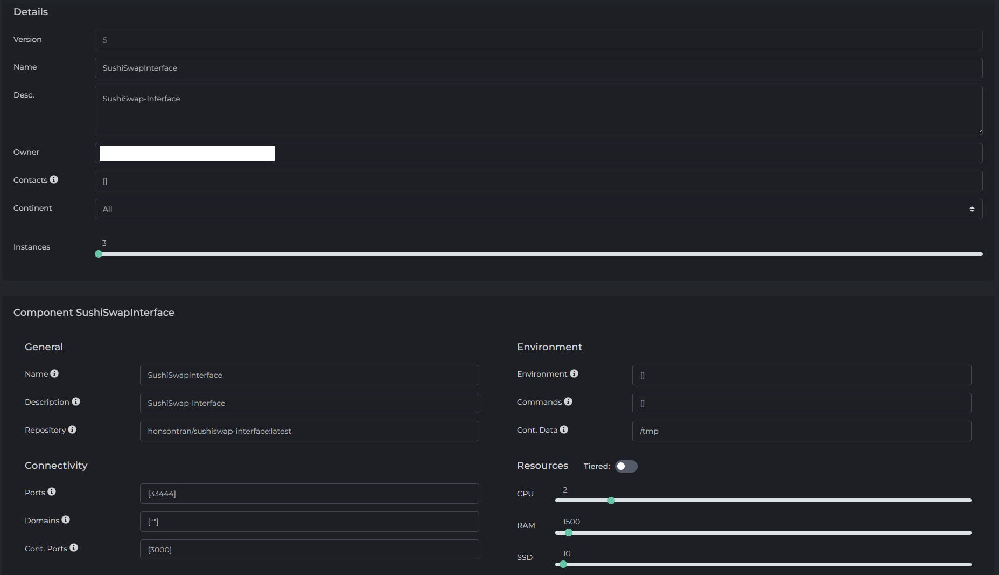

# Description
Forked from [sushiswap/sushiswap-interface](https://github.com/sushiswap/sushiswap-interface) and added a convenient `DockerFile` to package everything to an image for deployment.

# Flux Deployment Instructions
To build from source, the instructions are listed below. Feel free to use [this video](https://youtu.be/tuk_0COWRDA) as reference.

1. Build the image:
    ```
    docker build -t ${YourDockerHubUsername}/sushiswap-interface:latest -f Dockerfile.flux .
    ```
2. Push the image to your Docker Hub account.
3. If the image is not whitelisted, please reach out to the Flux team to have the image whitelisted.
4. Register the Flux app. Here is a sample snapshot of what the registration might look like:

    


# SUSHI
```
                                      ████████████████                                          
                                  ████░░▒▒▒▒▒▒░░░░▒▒▒▒██████                                    
                                ██▒▒░░▒▒░░░░░░░░░░░░░░░░░░░░████                                
                          ████████▒▒░░▒▒░░░░░░░░░░░░░░░░░░░░░░░░████                            
                    ▒▒▒▒██▒▒▒▒░░▒▒██████▒▒░░░░░░░░░░░░░░▒▒░░░░░░▒▒▒▒██                          
                ████░░▒▒░░▒▒░░░░░░░░░░░░████▒▒▒▒░░░░░░░░░░░░░░▒▒░░░░▒▒██                        
              ██░░░░░░░░▒▒░░▒▒░░░░░░░░░░░░░░████▒▒░░░░░░░░░░░░░░░░░░░░░░██                      
            ██▒▒░░░░░░░░░░░░░░░░░░░░░░░░░░░░▒▒▒▒████░░░░░░░░░░░░░░░░░░░░▒▒██                    
            ██░░░░░░░░░░░░░░░░░░░░░░░░░░░░░░░░░░░░░░██▒▒░░░░░░░░░░░░░░░░░░▒▒██                  
          ██░░▒▒░░░░░░░░░░░░░░░░░░▒▒░░░░░░▒▒░░░░░░░░▒▒██▒▒░░▒▒░░░░░░░░░░░░░░░░██                
      ▓▓▓▓▒▒░░░░░░░░░░░░░░░░░░░░░░░░░░░░░░░░░░░░░░░░▒▒▒▒██▒▒░░░░░░░░░░░░░░░░▒▒██                
  ████░░░░░░░░░░░░▒▒░░▒▒▒▒░░▒▒░░░░░░░░░░░░░░░░░░░░░░░░░░▒▒██▒▒░░░░░░░░░░░░░░░░▒▒██              
██░░░░░░░░░░▒▒▒▒▒▒▒▒▒▒▒▒▒▒░░▒▒▒▒░░▒▒░░░░░░░░░░░░░░░░░░░░░░░░██░░▒▒░░░░░░░░░░░░░░██              
██░░░░░░▒▒▒▒▒▒▒▒██████████▒▒▒▒▒▒░░▒▒▒▒░░░░░░▒▒▒▒░░░░░░░░░░▒▒▒▒▓▓▒▒░░░░░░░░░░░░░░▒▒██            
  ██▒▒▒▒▒▒██████░░░░░░░░░░██████▒▒▒▒▒▒░░▒▒░░▒▒▒▒░░░░░░░░░░▒▒░░░░██░░░░░░░░░░░░░░░░██            
  ████████      ██  ░░    ░░░░░░██████▒▒▒▒▒▒▒▒░░░░░░░░░░░░░░▒▒░░██▒▒▒▒░░░░░░░░░░░░░░██          
                ██            ░░░░░░░░████▒▒▒▒░░▒▒░░░░░░░░░░░░▒▒░░██▒▒▒▒░░░░▒▒▒▒░░░░░░██        
                  ████    ░░    ░░    ░░░░████▒▒▒▒▒▒░░░░░░░░░░░░░░████▒▒░░░░░░░░░░░░░░▒▒██      
                      ████        ░░  ░░  ░░░░██▒▒░░▒▒░░░░░░░░░░░░▒▒████▒▒▒▒░░░░░░░░░░░░░░████  
                          ████                ░░██▒▒▒▒▒▒░░░░░░░░░░▒▒██░░██▒▒▒▒░░░░░░░░░░░░░░▒▒██
                              ▓▓▓▓  ░░    ░░░░  ░░██▒▒░░▒▒░░░░░░░░░░▒▒██  ██▒▒▒▒▒▒▒▒▒▒▒▒▒▒▒▒██  
                                  ████████        ░░██▒▒▒▒▒▒░░░░░░░░░░▒▒██████▒▒▒▒░░░░▒▒████    
                                  ░░░░░░  ▓▓██████████▒▒▒▒▒▒░░░░░░░░░░░░▒▒▒▒▒▒▒▒██▓▓▓▓▓▓  ░░    
                                                      ██▒▒▒▒▒▒▒▒░░░░░░░░░░░░▒▒██                
                                                        ████▒▒▒▒▒▒░░░░░░▒▒▒▒██                  
                                                            ████▒▒▒▒▒▒▒▒████                    
                                                                ████████                        
```
